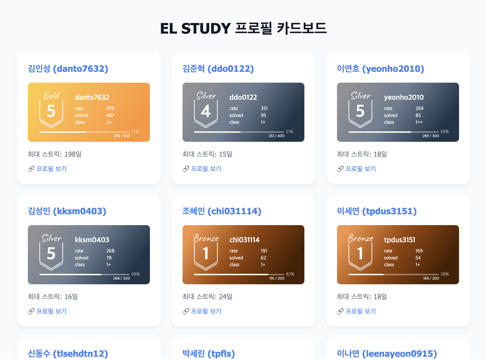
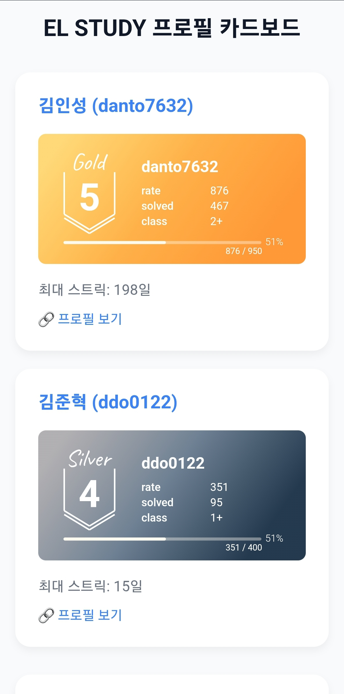

# solved.ac 스터디 프로필 카드보드 📊

코딩 스터디 그룹의 solved.ac 프로필 정보를 실시간으로 확인할 수 있는 오픈소스 웹 애플리케이션입니다.

> **EL 전공동아리 사용 사례**: 자료구조&알고리즘 스터디 (2학년 대상, 하루 최소 한 문제 목표)

## 📱 시연 화면

| PC 화면 | 모바일 화면 |
|---------|-------------|
|  |  |

## ✨ 주요 기능

- 📈 **실시간 프로필 조회**: solved.ac API를 통한 최신 데이터 수집
- 🏆 **티어 시각화**: mazassumnida.wtf API를 활용한 티어 배지 표시  
- 🔥 **스트릭 추적**: 각 멤버의 최대 연속 문제 해결 기록
- 📱 **반응형 디자인**: PC/모바일 환경 모두 지원
- ⚡ **자동 업데이트**: 서버리스 함수를 통한 실시간 데이터 갱신
- 🎯 **레이팅 순 정렬**: 스터디 내 순위 확인

## 📁 프로젝트 구조

```
solvedac_profile/
├── .github/workflows/
│   └── update-profiles.yml  # GitHub Actions 자동 업데이트 워크플로우
├── api/
│   ├── proxy.js          # CORS 우회를 위한 프록시 서버
│   └── update.js         # solved.ac API 데이터 수집 및 업데이트
├── data/
│   └── profiles.json     # 스터디원 프로필 데이터 (자동 생성)
├── image/
│   ├── mobilemain.png    # 모바일 메인 이미지
│   └── pcmain.png        # PC 메인 이미지
├── index.html            # 메인 웹페이지
├── vercel.json           # Vercel 배포 설정
└── README.md
```

## 🚀 빠른 시작

1. **저장소 Fork & Clone**
2. **멤버 정보 수정**: `api/update.js`의 `users` 배열 편집
3. **Vercel 배포**: GitHub 연동으로 자동 배포

## 🔧 API 엔드포인트

### `/api/update`
- **기능**: 모든 스터디원의 solved.ac 데이터를 수집하여 profiles.json 업데이트
- **메서드**: GET
- **응답**: JSON 형태의 프로필 데이터 배열

### `/api/proxy`
- **기능**: CORS 문제 해결을 위한 프록시 서버
- **메서드**: GET
- **파라미터**: `url` (프록시할 URL)

## 👥 스터디 그룹 설정

### 멤버 추가/수정

`api/update.js` 파일의 `users` 배열을 수정하세요:

```javascript
const users = [
  { name: "실명", handle: "백준핸들" },
  { name: "김인성", handle: "danto7632" },
  // 원하는 만큼 추가...
];
```

### 자동 데이터 갱신

#### ⏰ 업데이트 주기
- **매시간 정각**: GitHub Actions를 통한 자동 업데이트 (1시간마다)
- **실시간 반영**: solved.ac 데이터 변경 후 최대 1시간 내 웹사이트에 반영
- **스트릭 초기화 대응**: solved.ac 오전 6시 스트릭 초기화 시점 고려한 업데이트
- **재시도 로직**: API 호출 실패 시 최대 3회 자동 재시도

#### 🔄 업데이트 방식
- **자동**: GitHub Actions 스케줄러 (cron: `0 * * * *`)
- **수동**: GitHub Actions 워크플로우 수동 실행
- **즉시**: `/api/update` 엔드포인트 직접 호출

## 📊 데이터 구조

### profiles.json 스키마

```json
[
  {
    "name": "김인성",
    "handle": "danto7632", 
    "tier": 11,
    "rating": 876,
    "maxStreak": 198,
    "class": 2,
    "classDecoration": "silver"
  }
]
```

### 필드 설명
- `name`: 실명
- `handle`: 백준 사용자 ID
- `tier`: solved.ac 티어 (0-30)
- `rating`: solved.ac 레이팅
- `maxStreak`: 최대 연속 해결 일수
- `class`: solved.ac 클래스
- `classDecoration`: 클래스 장식

## 🔧 기술적 특징

### 자동 업데이트 시스템
- solved.ac API v3 실시간 데이터 수집
- CORS 우회를 위한 프록시 서버
- 레이팅 기준 자동 정렬
- **스트릭 추적 최적화**: solved.ac 오전 6시 일일 초기화 시점을 고려한 데이터 수집
- 에러 발생 시 부분 데이터라도 서비스 제공

### UI/UX
- 반응형 카드 레이아웃 (PC/모바일 최적화)
- 호버 효과와 모던 디자인
- solved.ac 티어 배지 동적 표시

## 🌍 오픈소스 활용

이 프로젝트는 **어떤 코딩 스터디나 동아리**에서도 활용할 수 있도록 설계되었습니다.

### 활용 예시
- 대학 프로그래밍 동아리
- 코딩테스트 스터디 그룹  
- 기업 내 알고리즘 스터디
- 온라인 코딩 커뮤니티

### 커스터마이징
- 멤버 목록만 수정하면 바로 사용 가능
- 디자인과 레이아웃 자유롭게 변경
- 추가 기능 개발 및 기여 환영

## 🤝 기여하기

- 🐛 버그 제보: Issues 탭 활용
- 💡 기능 제안: Discussion 또는 Issues
- 🔧 코드 기여: Pull Request

## 👨‍💻 개발자

**김인성** - 기획 및 개발

---

**Made with ❤️ for coding study communities**  
*Originally created for EL 전공동아리*
